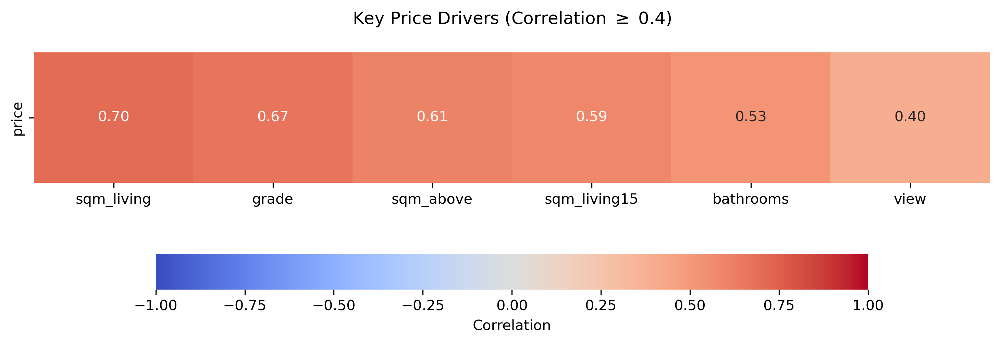
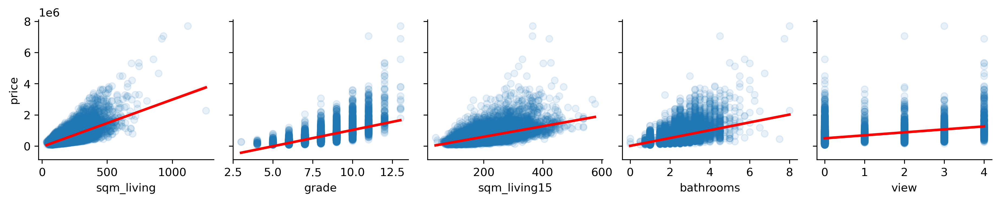

# EDA
# Exploratory Data Analysis

 For full dataset features description, sources, and limitations see [dataset_card.md](dataset_card.md) , and the full eda jupyter_notebook, see eda.ipyng in the notebooks. 

## 1. Data Quality

### Missing Values and duplicate rows

No missing values or duplicate rows were detected. 

### Numeric sanity check

All numerical values fall within plausible ranges. No negative values detected.

### Units and format

The date format in the dataset (20140617T000000) needed to be change to proper format to be able to be used later one by the ml model (2014-10-27 00:00:00). Moreoever, squaredFoot has been changed to squared meter to allows for better interpretability as europeans. 

## 2. Correlation & pairplot

The features that are most correlated with price are mainly about the physical space (sqm_living, sqm_linving 15, bathrooms) but also about the quality (grade)/view of the property. It seems that the history aspect or the location is less important. 
